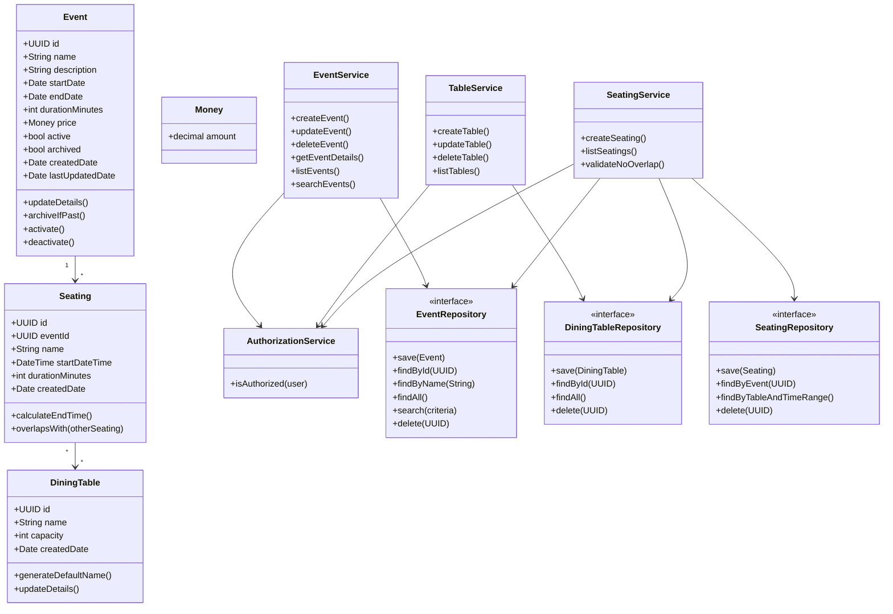

```mermaid
classDiagram

%% =====================================================
%% DOMAIN LAYER
%% =====================================================

class Event {
  +UUID id
  +String name
  +String description
  +Date startDate
  +Date endDate
  +int durationMinutes
  +Money price
  +bool active
  +bool archived
  +Date createdDate
  +Date lastUpdatedDate

  +updateDetails()
  +archiveIfPast()
  +activate()
  +deactivate()
}

class DiningTable {
  +UUID id
  +String name
  +int capacity
  +Date createdDate

  +generateDefaultName()
  +updateDetails()
}

class Seating {
  +UUID id
  +UUID eventId
  +String name
  +DateTime startDateTime
  +int durationMinutes
  +Date createdDate

  +calculateEndTime()
  +overlapsWith(otherSeating)
}

class Money {
  +decimal amount
}

Event "1" --> "*" Seating
Seating "*" --> "*" DiningTable

%% =====================================================
%% APPLICATION LAYER
%% =====================================================

class EventService {
  +createEvent()
  +updateEvent()
  +deleteEvent()
  +getEventDetails()
  +listEvents()
  +searchEvents()
}

class TableService {
  +createTable()
  +updateTable()
  +deleteTable()
  +listTables()
}

class SeatingService {
  +createSeating()
  +listSeatings()
  +validateNoOverlap()
}

class AuthorizationService {
  +isAuthorized(user)
}

EventService --> EventRepository
TableService --> DiningTableRepository
SeatingService --> SeatingRepository
SeatingService --> DiningTableRepository
SeatingService --> EventRepository

EventService --> AuthorizationService
TableService --> AuthorizationService
SeatingService --> AuthorizationService

%% =====================================================
%% PERSISTENCE LAYER
%% =====================================================

class EventRepository {
  <<interface>>
  +save(Event)
  +findById(UUID)
  +findByName(String)
  +findAll()
  +search(criteria)
  +delete(UUID)
}

class DiningTableRepository {
  <<interface>>
  +save(DiningTable)
  +findById(UUID)
  +findAll()
  +delete(UUID)
}

class SeatingRepository {
  <<interface>>
  +save(Seating)
  +findByEvent(UUID)
  +findByTableAndTimeRange()
  +delete(UUID)
}
```
