# Sprint 1 - Events Module UML Class Diagram
## Developer: Olufunmbi (Events Only)

This diagram includes ONLY the Domain, Application, and Persistence layer components for YOUR Events module user stories.

```mermaid
classDiagram
    %% ============================================
    %% DOMAIN LAYER - Events Module
    %% ============================================
    
    class Event {
        <<Entity>>
        -Long id
        -String name
        -String description
        -LocalDate startDate
        -LocalDate endDate
        -Integer durationMinutes
        -BigDecimal price
        -Boolean active
        -Boolean archived
        -LocalDateTime createdDate
        -LocalDateTime updatedDate
        +Event()
        +Event(String, LocalDate, LocalDate, Integer, BigDecimal)
        +getId() Long
        +setId(Long) void
        +getName() String
        +setName(String) void
        +getDescription() String
        +setDescription(String) void
        +getStartDate() LocalDate
        +setStartDate(LocalDate) void
        +getEndDate() LocalDate
        +setEndDate(LocalDate) void
        +getDurationMinutes() Integer
        +setDurationMinutes(Integer) void
        +getPrice() BigDecimal
        +setPrice(BigDecimal) void
        +isActive() Boolean
        +setActive(Boolean) void
        +isArchived() Boolean
        +setArchived(Boolean) void
        +getCreatedDate() LocalDateTime
        +setCreatedDate(LocalDateTime) void
        +getUpdatedDate() LocalDateTime
        +setUpdatedDate(LocalDateTime) void
        +validate() boolean
        +validateDates() boolean
        +validateName() boolean
        +validatePrice() boolean
        +validateDuration() boolean
        +isPastEvent() boolean
    }

    class User {
        <<Entity>>
        -Long id
        -String username
        -String password
        -String email
        -String role
        -Boolean active
        -LocalDateTime createdDate
        +User()
        +User(String, String, String)
        +getId() Long
        +setId(Long) void
        +getUsername() String
        +setUsername(String) void
        +getPassword() String
        +setPassword(String) void
        +getEmail() String
        +setEmail(String) void
        +getRole() String
        +setRole(String) void
        +isActive() Boolean
        +setActive(Boolean) void
        +getCreatedDate() LocalDateTime
        +isAuthorized() boolean
        +isEmployee() boolean
        +hasRole(String) boolean
    }

    class EventSearchCriteria {
        <<ValueObject>>
        -String name
        -LocalDate startDate
        -LocalDate endDate
        -DateRangeFilter dateRangeFilter
        +EventSearchCriteria()
        +getName() String
        +setName(String) void
        +getStartDate() LocalDate
        +setStartDate(LocalDate) void
        +getEndDate() LocalDate
        +setEndDate(LocalDate) void
        +getDateRangeFilter() DateRangeFilter
        +setDateRangeFilter(DateRangeFilter) void
        +hasNameCriteria() boolean
        +hasDateCriteria() boolean
        +isEmpty() boolean
    }

    class DateRangeFilter {
        <<Enumeration>>
        ALL_DATES
        AFTER_DATE
        BEFORE_DATE
        BETWEEN_DATES
        +values() DateRangeFilter[]
        +valueOf(String) DateRangeFilter
    }

    %% ============================================
    %% APPLICATION LAYER - Events Module Services
    %% ============================================
    
    class EventService {
        <<Service>>
        -EventRepository eventRepository
        -UserService userService
        +EventService(EventRepository, UserService)
        +createEvent(Event) Event
        +getEventById(Long) Event
        +getAllEvents() List~Event~
        +getAllActiveEvents() List~Event~
        +updateEvent(Long, Event) Event
        +deleteEvent(Long) boolean
        +archiveEvent(Long) boolean
        +searchEvents(EventSearchCriteria) List~Event~
        +searchByName(String) List~Event~
        +searchByStartDate(LocalDate) List~Event~
        +searchByEndDate(LocalDate) List~Event~
        +filterByDateRange(LocalDate, LocalDate, DateRangeFilter) List~Event~
        +validateEventName(String) boolean
        +validateEventNameForUpdate(String, Long) boolean
        +isNameUnique(String) boolean
        +isNameUniqueExcludingId(String, Long) boolean
        +validateDates(LocalDate, LocalDate) boolean
        +shouldArchive(Event) boolean
    }

    class UserService {
        <<Service>>
        -UserRepository userRepository
        +UserService(UserRepository)
        +authenticateUser(String, String) User
        +isUserAuthorized(Long) boolean
        +isUserAuthorized(User) boolean
        +getUserById(Long) User
        +getUserByUsername(String) User
        +createUser(User) User
        +getCurrentUser() User
        +login(String, String) User
        +logout() void
        +registerUser(User) User
    }

    %% ============================================
    %% PERSISTENCE LAYER - Events Module
    %% ============================================
    
    class EventRepository {
        <<Repository>>
        +save(Event) Event
        +findById(Long) Optional~Event~
        +findAll() List~Event~
        +findAllActive() List~Event~
        +findAllArchived() List~Event~
        +update(Event) Event
        +delete(Long) void
        +existsById(Long) boolean
        +findByName(String) Optional~Event~
        +findByNameContainingIgnoreCase(String) List~Event~
        +findByStartDate(LocalDate) List~Event~
        +findByEndDate(LocalDate) List~Event~
        +findByStartDateBetween(LocalDate, LocalDate) List~Event~
        +findByEndDateBetween(LocalDate, LocalDate) List~Event~
        +findByStartDateAfter(LocalDate) List~Event~
        +findByStartDateBefore(LocalDate) List~Event~
        +findByEndDateAfter(LocalDate) List~Event~
        +findByEndDateBefore(LocalDate) List~Event~
        +findByCriteria(EventSearchCriteria) List~Event~
        +existsByName(String) boolean
        +existsByNameAndIdNot(String, Long) boolean
        +countAll() Long
        +countActive() Long
        +countArchived() Long
    }

    class UserRepository {
        <<Repository>>
        +save(User) User
        +findById(Long) Optional~User~
        +findAll() List~User~
        +update(User) User
        +delete(Long) void
        +findByUsername(String) Optional~User~
        +findByEmail(String) Optional~User~
        +existsByUsername(String) boolean
        +existsByEmail(String) boolean
        +findActiveUsers() List~User~
        +findByRole(String) List~User~
    }

    %% ============================================
    %% RELATIONSHIPS
    %% ============================================
    
    %% Service Dependencies
    EventService --> EventRepository : uses
    EventService --> Event : manages
    EventService --> EventSearchCriteria : uses
    EventService --> DateRangeFilter : uses
    EventService --> UserService : uses
    
    UserService --> UserRepository : uses
    UserService --> User : manages
    
    EventSearchCriteria --> DateRangeFilter : contains
    
    %% Repository Dependencies
    EventRepository --> Event : persists
    UserRepository --> User : persists
```

