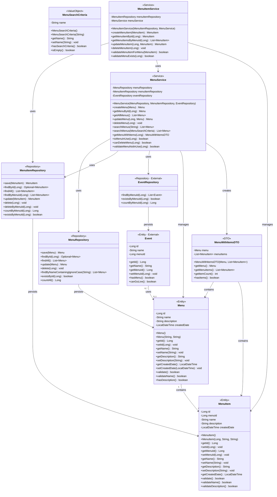

# Sprint 2 - Menu Module UML Class Diagram
## Developer: Olufunmbi

Shows my sprint 2 Menu User Stories

```mermaid
classDiagram
    %% ============================================
    %% DOMAIN LAYER - Sprint 2 Menu (NEW)
    %% ============================================
    
    class Menu {
        <<Entity>>
        -Long id
        -String name
        -String description
        -LocalDateTime createdDate
        +Menu()
        +Menu(String, String)
        +getId() Long
        +setId(Long) void
        +getName() String
        +setName(String) void
        +getDescription() String
        +setDescription(String) void
        +getCreatedDate() LocalDateTime
        +setCreatedDate(LocalDateTime) void
        +validate() boolean
        +validateName() boolean
        +hasDescription() boolean
    }

    class MenuItem {
        <<Entity>>
        -Long id
        -Long menuId
        -String name
        -String description
        -LocalDateTime createdDate
        +MenuItem()
        +MenuItem(Long, String, String)
        +getId() Long
        +setId(Long) void
        +getMenuId() Long
        +setMenuId(Long) void
        +getName() String
        +setName(String) void
        +getDescription() String
        +setDescription(String) void
        +getCreatedDate() LocalDateTime
        +validate() boolean
        +validateName() boolean
        +validateDescription() boolean
    }

    class MenuSearchCriteria {
        <<ValueObject>>
        -String name
        +MenuSearchCriteria()
        +MenuSearchCriteria(String)
        +getName() String
        +setName(String) void
        +hasSearchCriteria() boolean
        +isEmpty() boolean
    }

    class MenuWithItemsDTO {
        <<DTO>>
        -Menu menu
        -List~MenuItem~ menuItems
        +MenuWithItemsDTO(Menu, List~MenuItem~)
        +getMenu() Menu
        +getMenuItems() List~MenuItem~
        +getItemCount() int
        +hasItems() boolean
    }

    %% ============================================
    %% EXTERNAL REFERENCE - Sprint 1 Event
    %% ============================================
    
    class Event {
        <<Entity - External>>
        -Long id
        -String name
        -Long menuId
        +getId() Long
        +getName() String
        +getMenuId() Long
        +setMenuId(Long) void
        +hasMenu() boolean
        +canGoLive() boolean
    }

    %% ============================================
    %% APPLICATION LAYER - Sprint 2 Menu (NEW)
    %% ============================================
    
    class MenuService {
        <<Service>>
        -MenuRepository menuRepository
        -MenuItemRepository menuItemRepository
        -EventRepository eventRepository
        +MenuService(MenuRepository, MenuItemRepository, EventRepository)
        +createMenu(Menu) Menu
        +getMenuById(Long) Menu
        +getAllMenus() List~Menu~
        +updateMenu(Long, Menu) Menu
        +deleteMenu(Long) void
        +searchMenus(String) List~Menu~
        +searchMenus(MenuSearchCriteria) List~Menu~
        +getMenuWithItems(Long) MenuWithItemsDTO
        +isMenuInUse(Long) boolean
        +canDeleteMenu(Long) boolean
        +validateMenuNotInUse(Long) boolean
    }

    class MenuItemService {
        <<Service>>
        -MenuItemRepository menuItemRepository
        -MenuService menuService
        +MenuItemService(MenuItemRepository, MenuService)
        +createMenuItem(MenuItem) MenuItem
        +getMenuItemById(Long) MenuItem
        +getMenuItemsByMenuId(Long) List~MenuItem~
        +updateMenuItem(Long, MenuItem) MenuItem
        +deleteMenuItem(Long) void
        +validateMenuItemForMenu(MenuItem) boolean
        +validateMenuExists(Long) boolean
    }

    %% ============================================
    %% PERSISTENCE LAYER - Sprint 2 Menu (NEW)
    %% ============================================
    
    class MenuRepository {
        <<Repository>>
        +save(Menu) Menu
        +findById(Long) Optional~Menu~
        +findAll() List~Menu~
        +update(Menu) Menu
        +delete(Long) void
        +findByNameContainingIgnoreCase(String) List~Menu~
        +existsById(Long) boolean
        +countAll() Long
    }

    class MenuItemRepository {
        <<Repository>>
        +save(MenuItem) MenuItem
        +findById(Long) Optional~MenuItem~
        +findAll() List~MenuItem~
        +findByMenuId(Long) List~MenuItem~
        +update(MenuItem) MenuItem
        +delete(Long) void
        +deleteByMenuId(Long) void
        +countByMenuId(Long) Long
        +existsByMenuId(Long) boolean
    }

    class EventRepository {
        <<Repository - External>>
        +findByMenuId(Long) List~Event~
        +existsByMenuId(Long) boolean
        +countByMenuId(Long) Long
    }

    %% ============================================
    %% RELATIONSHIPS
    %% ============================================
    
    %% Domain Relationships
    Menu "1" --> "0..*" MenuItem : contains
    Event "0..*" --> "0..1" Menu : uses
    
    %% Service Dependencies
    MenuService --> MenuRepository : uses
    MenuService --> MenuItemRepository : uses
    MenuService --> EventRepository : uses
    MenuService --> Menu : manages
    MenuService --> MenuWithItemsDTO : creates
    
    MenuItemService --> MenuItemRepository : uses
    MenuItemService --> MenuService : uses
    MenuItemService --> MenuItem : manages
    
    MenuWithItemsDTO --> Menu : contains
    MenuWithItemsDTO --> MenuItem : contains
    
    %% Repository Dependencies
    MenuRepository --> Menu : persists
    MenuItemRepository --> MenuItem : persists
    EventRepository --> Event : persists

```