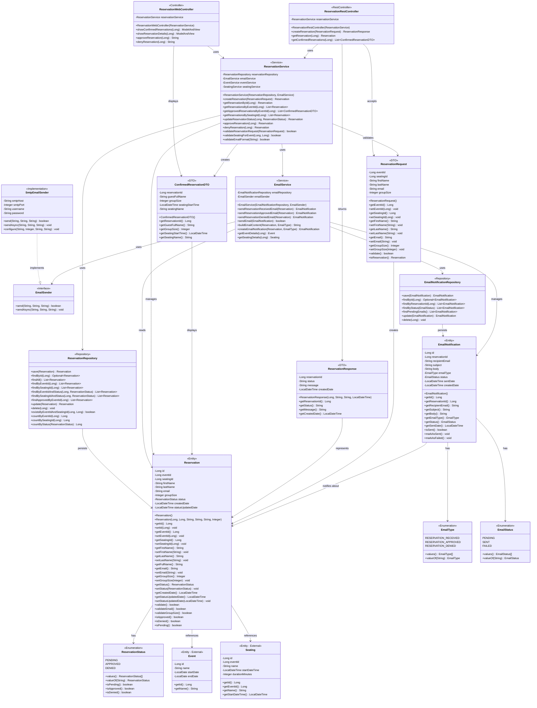

# Sprint 3 - Reservation & Email Module UML Class Diagram
## Developer: Olufunmbi

My Sprint 3 Diagram, which includes: Email notifications, and REST API.

```mermaid
classDiagram
    %% ============================================
    %% DOMAIN LAYER - Sprint 3 Reservations (NEW)
    %% ============================================
    
    class Reservation {
        <<Entity>>
        -Long id
        -Long eventId
        -Long seatingId
        -String firstName
        -String lastName
        -String email
        -Integer groupSize
        -ReservationStatus status
        -LocalDateTime createdDate
        -LocalDateTime statusUpdatedDate
        +Reservation()
        +Reservation(Long, Long, String, String, String, Integer)
        +getId() Long
        +setId(Long) void
        +getEventId() Long
        +setEventId(Long) void
        +getSeatingId() Long
        +setSeatingId(Long) void
        +getFirstName() String
        +setFirstName(String) void
        +getLastName() String
        +setLastName(String) void
        +getFullName() String
        +getEmail() String
        +setEmail(String) void
        +getGroupSize() Integer
        +setGroupSize(Integer) void
        +getStatus() ReservationStatus
        +setStatus(ReservationStatus) void
        +getCreatedDate() LocalDateTime
        +getStatusUpdatedDate() LocalDateTime
        +setStatusUpdatedDate(LocalDateTime) void
        +validate() boolean
        +validateEmail() boolean
        +validateGroupSize() boolean
        +isApproved() boolean
        +isDenied() boolean
        +isPending() boolean
    }

    class ReservationStatus {
        <<Enumeration>>
        PENDING
        APPROVED
        DENIED
        +values() ReservationStatus[]
        +valueOf(String) ReservationStatus
        +isPending() boolean
        +isApproved() boolean
        +isDenied() boolean
    }

    class EmailNotification {
        <<Entity>>
        -Long id
        -Long reservationId
        -String recipientEmail
        -String subject
        -String body
        -EmailType emailType
        -EmailStatus status
        -LocalDateTime sentDate
        -LocalDateTime createdDate
        +EmailNotification()
        +getId() Long
        +getReservationId() Long
        +getRecipientEmail() String
        +getSubject() String
        +getBody() String
        +getEmailType() EmailType
        +getStatus() EmailStatus
        +getSentDate() LocalDateTime
        +isSent() boolean
        +markAsSent() void
        +markAsFailed() void
    }

    class EmailType {
        <<Enumeration>>
        RESERVATION_RECEIVED
        RESERVATION_APPROVED
        RESERVATION_DENIED
        +values() EmailType[]
        +valueOf(String) EmailType
    }

    class EmailStatus {
        <<Enumeration>>
        PENDING
        SENT
        FAILED
        +values() EmailStatus[]
        +valueOf(String) EmailStatus
    }

    class ReservationRequest {
        <<DTO>>
        -Long eventId
        -Long seatingId
        -String firstName
        -String lastName
        -String email
        -Integer groupSize
        +ReservationRequest()
        +getEventId() Long
        +setEventId(Long) void
        +getSeatingId() Long
        +setSeatingId(Long) void
        +getFirstName() String
        +setFirstName(String) void
        +getLastName() String
        +setLastName(String) void
        +getEmail() String
        +setEmail(String) void
        +getGroupSize() Integer
        +setGroupSize(Integer) void
        +validate() boolean
        +toReservation() Reservation
    }

    class ReservationResponse {
        <<DTO>>
        -Long reservationId
        -String status
        -String message
        -LocalDateTime createdDate
        +ReservationResponse(Long, String, String, LocalDateTime)
        +getReservationId() Long
        +getStatus() String
        +getMessage() String
        +getCreatedDate() LocalDateTime
    }

    class ConfirmedReservationDTO {
        <<DTO>>
        -Long reservationId
        -String guestFullName
        -Integer groupSize
        -LocalDateTime seatingStartTime
        -String seatingName
        +ConfirmedReservationDTO()
        +getReservationId() Long
        +getGuestFullName() String
        +getGroupSize() Integer
        +getSeatingStartTime() LocalDateTime
        +getSeatingName() String
    }

    %% ============================================
    %% EXTERNAL REFERENCES (From Partner/Sprint 1)
    %% ============================================
    
    class Event {
        <<Entity - External>>
        -Long id
        -String name
        -LocalDate startDate
        -LocalDate endDate
        +getId() Long
        +getName() String
    }

    class Seating {
        <<Entity - External>>
        -Long id
        -Long eventId
        -String name
        -LocalDateTime startDateTime
        -Integer durationMinutes
        +getId() Long
        +getEventId() Long
        +getName() String
        +getStartDateTime() LocalDateTime
    }

    %% ============================================
    %% APPLICATION LAYER - Sprint 3 (NEW)
    %% ============================================
    
    class ReservationService {
        <<Service>>
        -ReservationRepository reservationRepository
        -EmailService emailService
        -EventService eventService
        -SeatingService seatingService
        +ReservationService(ReservationRepository, EmailService)
        +createReservation(ReservationRequest) Reservation
        +getReservationById(Long) Reservation
        +getReservationsByEventId(Long) List~Reservation~
        +getApprovedReservationsByEventId(Long) List~ConfirmedReservationDTO~
        +getReservationsBySeatingId(Long) List~Reservation~
        +updateReservationStatus(Long, ReservationStatus) Reservation
        +approveReservation(Long) Reservation
        +denyReservation(Long) Reservation
        +validateReservationRequest(ReservationRequest) boolean
        +validateSeatingForEvent(Long, Long) boolean
        +validateEmailFormat(String) boolean
    }

    class EmailService {
        <<Service>>
        -EmailNotificationRepository emailRepository
        -EmailSender emailSender
        +EmailService(EmailNotificationRepository, EmailSender)
        +sendReservationReceivedEmail(Reservation) EmailNotification
        +sendReservationApprovedEmail(Reservation) EmailNotification
        +sendReservationDeniedEmail(Reservation) EmailNotification
        +sendEmail(EmailNotification) boolean
        +buildEmailContent(Reservation, EmailType) String
        +createEmailNotification(Reservation, EmailType) EmailNotification
        +getEventDetails(Long) Event
        +getSeatingDetails(Long) Seating
    }

    class EmailSender {
        <<Interface>>
        +send(String, String, String) boolean
        +sendAsync(String, String, String) void
    }

    class ReservationRestController {
        <<RestController>>
        -ReservationService reservationService
        +ReservationRestController(ReservationService)
        +createReservation(ReservationRequest) ReservationResponse
        +getReservation(Long) Reservation
        +getConfirmedReservations(Long) List~ConfirmedReservationDTO~
    }

    class ReservationWebController {
        <<Controller>>
        -ReservationService reservationService
        +ReservationWebController(ReservationService)
        +showConfirmedReservations(Long) ModelAndView
        +showReservationDetails(Long) ModelAndView
        +approveReservation(Long) String
        +denyReservation(Long) String
    }

    %% ============================================
    %% INFRASTRUCTURE LAYER - Sprint 3 (NEW)
    %% ============================================
    
    class SmtpEmailSender {
        <<Implementation>>
        -String smtpHost
        -Integer smtpPort
        -String username
        -String password
        +send(String, String, String) boolean
        +sendAsync(String, String, String) void
        +configure(String, Integer, String, String) void
    }

    %% ============================================
    %% PERSISTENCE LAYER - Sprint 3 (NEW)
    %% ============================================
    
    class ReservationRepository {
        <<Repository>>
        +save(Reservation) Reservation
        +findById(Long) Optional~Reservation~
        +findAll() List~Reservation~
        +findByEventId(Long) List~Reservation~
        +findBySeatingId(Long) List~Reservation~
        +findByEventIdAndStatus(Long, ReservationStatus) List~Reservation~
        +findBySeatingIdAndStatus(Long, ReservationStatus) List~Reservation~
        +findApprovedByEventId(Long) List~Reservation~
        +update(Reservation) Reservation
        +delete(Long) void
        +existsByEventIdAndSeatingId(Long, Long) boolean
        +countByEventId(Long) Long
        +countBySeatingId(Long) Long
        +countByStatus(ReservationStatus) Long
    }

    class EmailNotificationRepository {
        <<Repository>>
        +save(EmailNotification) EmailNotification
        +findById(Long) Optional~EmailNotification~
        +findByReservationId(Long) List~EmailNotification~
        +findByStatus(EmailStatus) List~EmailNotification~
        +findPendingEmails() List~EmailNotification~
        +update(EmailNotification) EmailNotification
        +delete(Long) void
    }

    %% ============================================
    %% RELATIONSHIPS
    %% ============================================
    
    %% Domain Relationships
    Reservation --> ReservationStatus : has
    Reservation --> Event : references
    Reservation --> Seating : references
    EmailNotification --> Reservation : notifies about
    EmailNotification --> EmailType : has
    EmailNotification --> EmailStatus : has
    
    %% DTO Relationships
    ReservationRequest --> Reservation : creates
    ReservationResponse --> Reservation : represents
    ConfirmedReservationDTO --> Reservation : displays
    
    %% Service Dependencies
    ReservationService --> ReservationRepository : uses
    ReservationService --> EmailService : uses
    ReservationService --> Reservation : manages
    ReservationService --> ReservationRequest : validates
    ReservationService --> ConfirmedReservationDTO : creates
    
    EmailService --> EmailNotificationRepository : uses
    EmailService --> EmailSender : uses
    EmailService --> EmailNotification : manages
    EmailService --> Reservation : reads
    
    %% Controller Dependencies
    ReservationRestController --> ReservationService : uses
    ReservationRestController --> ReservationRequest : accepts
    ReservationRestController --> ReservationResponse : returns
    
    ReservationWebController --> ReservationService : uses
    ReservationWebController --> ConfirmedReservationDTO : displays
    
    %% Infrastructure
    SmtpEmailSender ..|> EmailSender : implements
    
    %% Repository Dependencies
    ReservationRepository --> Reservation : persists
    EmailNotificationRepository --> EmailNotification : persists

```